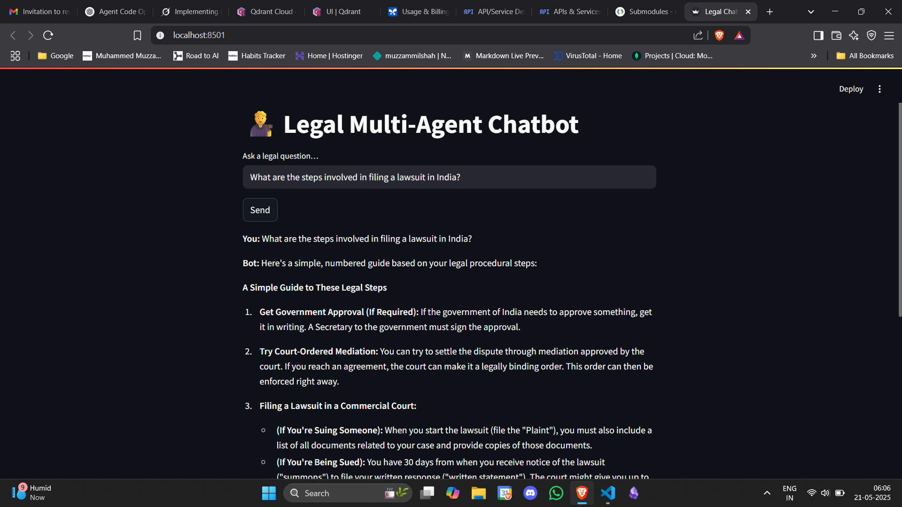
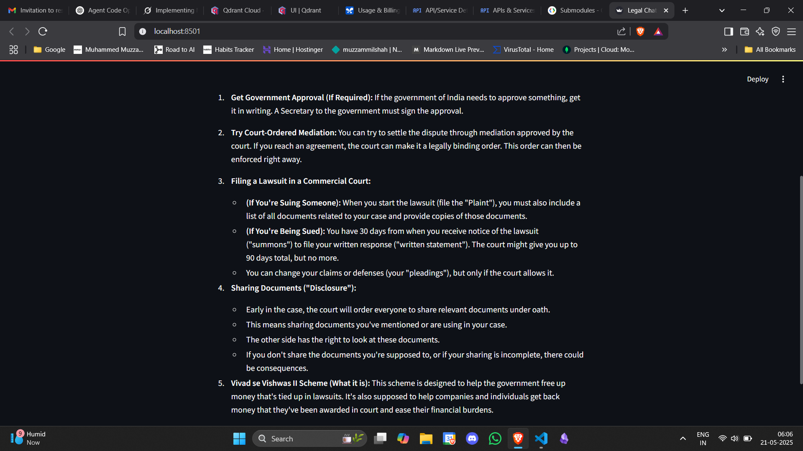
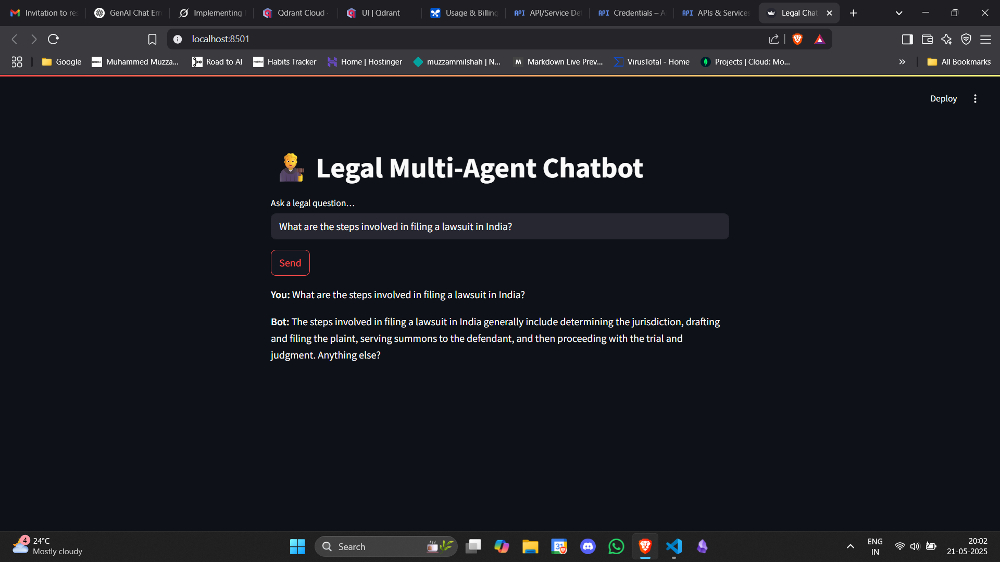
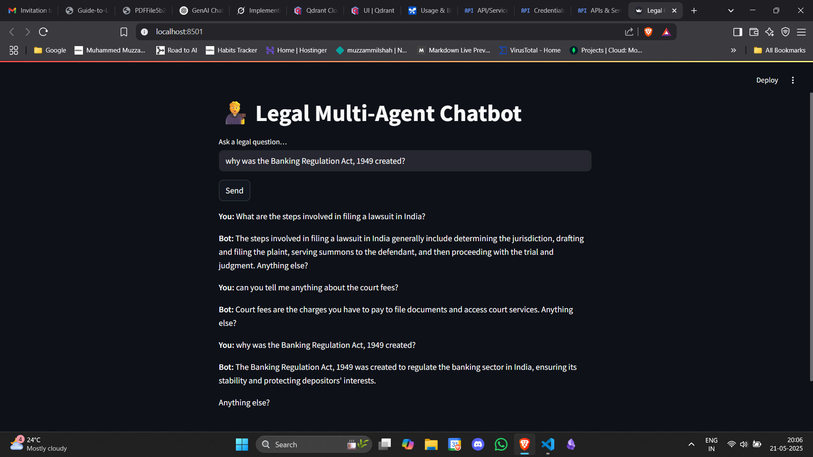

## 🧑‍⚖️ **Legal Multi-Agent Chatbot**

A Streamlit-based chatbot that leverages Google Gemini API, Qdrant and LangGraph for multi-agent legal question answering. It uses a **Query Agent** to fetch relevant legal text, a **Summarization Agent** to convert complex legal excerpts into plain-language steps, and a **Response Agent to deliver concise answers and invite follow-ups**.

---

### 📋 Features

* **Multi-Agent Flow**: Modular agents for querying, summarization, and response formatting.
* **Context Management**: Trims document chunks and limits token usage to prevent context overflow.
* **Semantic Search**: Uses Gemini embeddings (768‑dim) and Qdrant for fast, relevant chunk retrieval.
* **Plain‑Language Summaries**: Converts legal jargon into easy‑to‑follow responses.
* **Follow‑Up Support**: Bot always asks "Anything else?" to keep the conversation going.
* **Streamlit UI**: Simple web interface to communicate with the agent.

---

### 🌐 Deployment

This project is optimized for deployment on **Streamlit Community Cloud** and is publicly accessible [here](https://legal-agent-chat.streamlit.app/).

---

### 📺 Demo

- **📹 [Video Demo](https://drive.google.com/file/d/1udtv9oGlmj1R14FcQXzwBUHPU_oZ0fYQ/view?usp=sharing)** of Agent running in the local setup during development

- **📹 [Video Demo](https://drive.google.com/file/d/1nue1pUS77o2JsiG-D4i_jwP1yL84APPJ/view?usp=sharing)** of Agent running after being deployed

---

### 📝 Architecture Overview and Code implementations

1. **app.py**: Handles user input, maintains chat conversation, and invokes the compiled state graph

2. **agents.py**:

   * **QueryAgent**: Retrieves and trims relevant chunks via `vectorstore.retrieve_relevant_chunks()`.
   * **SummarizationAgent**: Calls Gemini to produce a numbered, plain‑language guide.
   * **ResponseAgent**: Crafts a concise reply and always asks for follow‑ups.

3. **vectorstore.py**:

   * Initializes a Gemini client and Qdrant client.
   * Embeds queries using a 768‑dimensional model (`models/text-embedding-004`).
   * Searches Qdrant and returns the top text snippets.

4. **qdrant_setup.py**:

   * Initializes the Qdrant collection and ingest embeddings.
   * The PDFs are stored in the `/data` directory and the embeddings are then stored in the Qdrant cloud.
---

## 🌟 Challenges faced and possible improvements

1. **First major challenge** was getting the embeddings for the documents — since they form the core knowledge base. FAISS was the go-to solution initially, but since the final app needed to be deployed, I went ahead with **Qdrant**, as they offer a very generous cloud service.
    
2. **Converting the PDFs into embedding chunks** took the most time (you can see the commit history — around 3 hours). Tried multiple approaches here:
    
    - First, I used the embeddings provided by **Gemini**, but we kept running into quota limits. The workaround was to add wait times and break things down into even smaller chunks, but there were still fragments of data getting skipped due to quota restrictions.

    

    
    
Loss of chunks of data

    

        
    - So, switched to an open-source solution (to the rescue again — yay!). I already have an **Ollama** server set up on my machine, so all I had to do was pull an embedding model and point my code to the local server.
        
    - After that, generating the embeddings was a breeze. But… the next issue popped up — **storing them in Qdrant**.
        
    - A few minutes of debugging later, I just had to get the syntax right to store all the points (i.e., the embedded chunks) onto the hosted Qdrant server.
        
3. **Using an open-source embedding model was great**, but how do I access it while the app is running?
    
    - I used the Gemini API as the "LLM brain" of the agent, but still needed access to an embedding model during runtime.
        
    - Since I had used an open-source model, the dimensions was smaller — which worked well with Qdrant. But when I tried Gemini’s embeddings, they were much longer. So, to fix that, I resized the output and (just to be safe) switched to a different model offered by gemini.
        
4. **Final step** was improving the output, supporting follow-ups, and maintaining conversation history.
    
    - This part was handled using **LangGraph**, by carefully structuring each task with specific prompts.

    

      <table>
        <tr>
          <td></td>
          <td></td>
        </tr>
        <tr>
          <td></td>
          <td></td>
        </tr>
      </table>
      
      
<i>Different stages of Agent improvement ✨</i>

    
       
    

**Improvements:**

- Having a strict response control, to ensure that even if the user deviates from what can be asked (As the core brain is handled by the LLM itself whose knowledge is very vast), the agent should strictly stick to the knowledge base only.

- Better embedding model and retrieval methods to further improve the response provided. Therefore also improving the context and embedding size window.

- Agentic Memory implementation to have a much realistic conversation with the agent.

---

### 🧰 Local Development

Follow instructions in [installations file](installations.md).